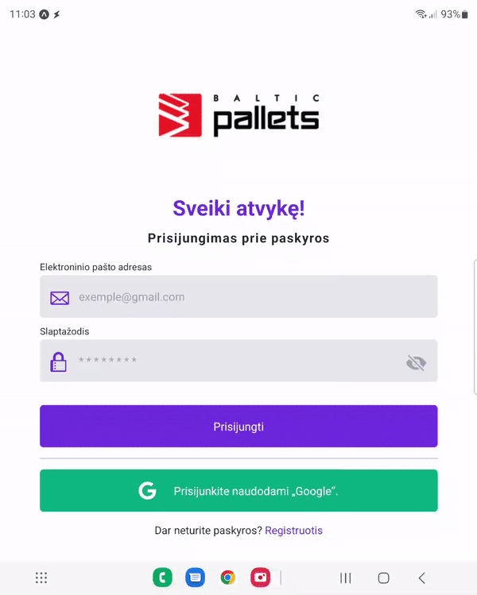

# Client service program

This project is Client service program for company 

Feature
- Index
  - [x] Login(Disconnected from the server)
  - [x] Register(Disabled because no need)
  - [x] Sign in with Google Play
- Welcome page
  - [x] welcome interface 
  - [x] Log out button
- Buy page
  - [x] Table with inputs and results
  - [x] Calculation system
  - [x] Double tap to open price editor on price
  - [x] Print & Save(after print will save information about items)
  - [x] Settings to resize content
- History page
  - [x] DataTable
  - [x] Clear History
  - [x] Daily report
  - [x] Print client items
  - [x] Check button if payment is done
- System
  - [x] Auto reset history nex day

# Login page
`enter some letters.` 

# Buy Page

# History Page

# Requires
- SDK 43
- Node.JS(for server folder)
- React `17.0.1`
- React Native `0.64.3`
- Expo `43.0.2`
